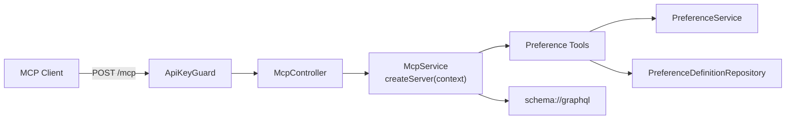

# MCP Integration Guide

## Overview

The backend exposes a Model Context Protocol endpoint at `/mcp` for preference discovery and mutation. The MCP surface is narrower than the GraphQL API on purpose: MCP can discover preference definitions, read a user's preferences, create suggestions, delete preferences, and read the GraphQL schema resource.

## Architecture



## Authentication

The MCP endpoint uses the same API-key auth model as the rest of the workshop backend.

Every request must include:

```http
Authorization: Bearer <apiKey>
```

And one user identity mechanism:

1. `X-User-Id: <userId>` preferred
2. `?asUser=<userId>` fallback for clients that only support a URL
3. Compound bearer token: `Authorization: Bearer <apiKey>.<userId>`

The server always scopes tool execution to the authenticated user context.

### Transport: POST-only JSON-response mode

`POST /mcp` is the only supported method. `GET /mcp` returns `405 Method Not Allowed`. This is intentional — the server uses stateless JSON-response mode; no SSE streaming or persistent sessions.

### Origin Validation

Requests with an `Origin` header (browser clients) are validated against an allowlist to prevent DNS-rebinding attacks:

- `MCP_HTTP_ALLOWED_ORIGINS` set → use that list
- `MCP_HTTP_ALLOWED_ORIGINS` unset, `CORS_ORIGIN` set → fall back to the app's CORS origins
- Both unset → `http://localhost:3000`, `http://localhost:3001`, `http://localhost:3002`, `http://127.0.0.1:3002` (matches app CORS defaults)

Non-browser clients (CLI tools, native MCP clients) that omit the `Origin` header are allowed through unconditionally — DNS-rebinding attacks require a browser.

### User Context Isolation

**Critical Security Feature**: The MCP server automatically extracts the `userId` from the API key and ensures:

1. Users can only search their own preferences
2. Users can only create preferences for themselves
3. Users can only update/delete their own preferences

**The userId is NEVER accepted as a parameter** - it's always extracted from the authenticated context.

## Supported Tools

### `listPreferenceSlugs`

Lists preference definitions visible to the authenticated user, including user-owned definitions.

Arguments:

```json
{
  "category": "food"
}
```

### `searchPreferences`

Searches the user's preferences.

Arguments:

```json
{
  "query": "travel",
  "locationId": "optional-location-id",
  "includeSuggestions": true
}
```

Notes:

- `category` is still accepted as a deprecated alias for `query`.
- When `locationId` is present, results use the merged location-aware preference view.

### `suggestPreference`

Creates or updates a `SUGGESTED` preference.

Arguments:

```json
{
  "slug": "system.response_tone",
  "value": "\"professional\"",
  "confidence": 0.9,
  "locationId": "optional-location-id",
  "evidence": "{\"reason\":\"Mentioned in chat\"}"
}
```

Notes:

- `value` must be a JSON string, not a raw JSON object.
- `evidence` must also be a JSON string when provided.
- MCP writes only create suggestions; they never write `ACTIVE` preferences directly.

### `deletePreference`

Deletes a preference by id.

Arguments:

```json
{
  "id": "preference-id"
}
```

## Supported Resources

### `schema://graphql`

Returns the generated GraphQL schema from `apps/backend/src/schema.gql`.

## Configuration

```env
MCP_HTTP_ENABLED=true
MCP_HTTP_ALLOWED_ORIGINS=https://example.com   # Allowed browser origins (comma-separated)
MCP_TOOLS_PREFERENCES_ENABLED=true
MCP_TOOLS_PREFERENCES_MAX_SEARCH_RESULTS=100
MCP_RESOURCES_SCHEMA_ENABLED=true
```

Notes:

- The MCP route is fixed at `/mcp`.
- Auth is always enforced on `/mcp`.
- There is no stdio MCP entrypoint in this repo.

## Usage Examples

### List Tools

```bash
curl -N -X POST "http://localhost:3000/mcp?asUser=<userId>" \
  -H "Authorization: Bearer <apiKey>" \
  -H "Content-Type: application/json" \
  -d '{
    "jsonrpc": "2.0",
    "method": "tools/list",
    "id": 1
  }'
```

### List User-Visible Preference Slugs

```bash
curl -N -X POST "http://localhost:3000/mcp?asUser=<userId>" \
  -H "Authorization: Bearer <apiKey>" \
  -H "Content-Type: application/json" \
  -d '{
    "jsonrpc": "2.0",
    "method": "tools/call",
    "params": {
      "name": "listPreferenceSlugs",
      "arguments": {
        "category": "travel"
      }
    },
    "id": 2
  }'
```

### Suggest a Preference

```bash
curl -N -X POST "http://localhost:3000/mcp?asUser=<userId>" \
  -H "Authorization: Bearer <apiKey>" \
  -H "Content-Type: application/json" \
  -d '{
    "jsonrpc": "2.0",
    "method": "tools/call",
    "params": {
      "name": "suggestPreference",
      "arguments": {
        "slug": "system.response_tone",
        "value": "\"professional\"",
        "confidence": 0.9
      }
    },
    "id": 3
  }'
```

### Read the GraphQL Schema Resource

```bash
curl -N -X POST "http://localhost:3000/mcp?asUser=<userId>" \
  -H "Authorization: Bearer <apiKey>" \
  -H "Content-Type: application/json" \
  -d '{
    "jsonrpc": "2.0",
    "method": "resources/read",
    "params": {
      "uri": "schema://graphql"
    },
    "id": 4
  }'
```

## MCP Inspector

```bash
npx @modelcontextprotocol/inspector "http://localhost:3000/mcp?asUser=<userId>" \
  --header "Authorization: Bearer <apiKey>"
```

## Testing

Run the dedicated MCP suite:

```bash
pnpm --filter backend test:e2e:mcp
```

That suite covers:

- advertised tool list
- namespace-aware `listPreferenceSlugs`
- `searchPreferences` category alias support
- `suggestPreference` and `deletePreference`
- `schema://graphql` resource reads
- per-request MCP server isolation across concurrent users
