# MCP Read Logs Rough Plan

- Status: active-plan
- Read when: planning MCP read/access logging, MCP audit APIs, or future access-history UX
- Source of truth: `apps/backend/src/mcp/**`, `apps/backend/src/modules/preferences/audit/**`, `apps/backend/prisma/schema.prisma`, `apps/backend/test/e2e/mcp.e2e-spec.ts`
- Last reviewed: 2026-04-18

## Background

The shipped audit groundwork is mutation-focused:

- one append-only `PreferenceAuditEvent` table for preference and definition mutations
- mutation provenance via `actorType`, `actorClientKey`, `origin`, and `correlationId`
- atomic mutation-plus-audit writes inside service transactions

That is a good fit for writes, but a weaker fit for MCP reads.

Why:

- many MCP reads are request-shaped rather than row-shaped
- many MCP reads do not have one obvious `targetId`
- some MCP reads are discovery or introspection operations rather than preference-state reads

Examples from the current MCP surface:

- `tools/call` for `searchPreferences`
- `tools/call` for `listPreferenceSlugs`
- `tools/call` for `smartSearchPreferences`
- `tools/call` for `listPermissionGrants`
- `resources/read` for `schema://graphql`
- possibly `tools/list` and `resources/list` if we decide discovery calls should count

## Rough Design Decision

Current preferred direction:

- do not force MCP read/access events into `PreferenceAuditEvent`
- add a separate request-level MCP log table, tentatively `McpReadEvent`
- log base events centrally in `McpService`
- allow tools and resources to attach optional sanitized metadata

This keeps the existing preference audit log focused on "what changed" while giving MCP access history its own shape.

## Why Not Reuse PreferenceAuditEvent

The current table shape is mutation-oriented:

- `targetType`
- required `targetId`
- `beforeState`
- `afterState`

That works well for preference/definition writes, but is awkward for:

- list operations
- search operations
- workflow-backed reads that may return multiple categories of results
- discovery/introspection reads such as `schema://graphql`

If read events are stuffed into the same table, likely outcomes are:

- noisy timelines that mix "state changed" with "client looked at something"
- nullable and semantically stretched fields
- harder UX because product history and access telemetry become one surface

## Instrumentation Model

There are two separate design axes:

1. Where the logging logic lives
- centralized in `McpService`
- inside each tool/resource
- or both

2. Where logs are stored
- DB table
- application logs
- external telemetry
- or multiple sinks

The preferred "hybrid" model here refers to axis 1, not axis 2.

Hybrid instrumentation means:

- every MCP read gets one central base log event
- individual tools/resources may add extra metadata when generic fields are not enough

It does not inherently mean:

- DB table plus application logs

That storage choice is separate.

## Sketch

```mermaid
flowchart TD
    A["MCP request"] --> B["McpService central logger"]
    B --> C{"Operation type"}
    C --> D["tools/call searchPreferences"]
    C --> E["tools/call listPreferenceSlugs"]
    C --> F["resources/read schema://graphql"]

    B --> G["Base event<br/>userId<br/>clientKey<br/>operation<br/>surface<br/>outcome<br/>latencyMs<br/>correlationId"]

    D --> H["Optional metadata<br/>locationId<br/>includeSuggestions<br/>counts<br/>returned slugs"]
    E --> I["Optional metadata<br/>category filter<br/>result count"]
    F --> J["Optional metadata<br/>uri<br/>cache hit or miss"]

    H --> G
    I --> G
    J --> G
```

## Proposed Event Shape

Tentative request-level table:

- `id`
- `occurredAt`
- `userId`
- `clientKey`
- `surface`
- `operationType`
- `operationName`
- `resourceUri?`
- `outcome`
- `correlationId`
- `latencyMs`
- `requestMetadata?`
- `responseMetadata?`
- `errorMetadata?`

Possible enum ideas:

- `surface`
  - `TOOLS_CALL`
  - `RESOURCES_READ`
  - optionally `TOOLS_LIST`
  - optionally `RESOURCES_LIST`
- `outcome`
  - `SUCCESS`
  - `DENY`
  - `ERROR`

Initial index ideas:

- `(userId, occurredAt desc)`
- `(userId, clientKey, occurredAt desc)`
- `(operationName, occurredAt desc)`
- `(outcome, occurredAt desc)`
- `(correlationId)`

## What The Central Layer Should Log

Base fields that should be available for every request:

- `userId`
- `clientKey`
- `surface`
- `operationName`
- `outcome`
- `occurredAt`
- `latencyMs`
- `correlationId` if available, otherwise a generated request id

Behavior:

- log successful reads
- log authorization denials
- log handler/runtime errors
- prefer fail-open behavior so read requests do not fail just because the logging write failed

## What Tool-Specific Metadata Can Add

The central event should stay generic. Tool/resource code can optionally add domain detail.

Examples:

### `searchPreferences`

Useful metadata:

- `locationId`
- `includeSuggestions`
- `queryPresent`
- `queryLength`
- `activeCount`
- `suggestedCount`
- maybe returned slugs

Avoid by default:

- full result payload
- raw preference values
- raw search text if it can contain sensitive free-form content

### `listPreferenceSlugs`

Useful metadata:

- `category`
- `count`
- returned slugs or categories

### `smartSearchPreferences`

Useful metadata:

- `locationId`
- `includeSuggestions`
- `queryPresent`
- `queryLength`
- matched definition count
- matched active count
- matched suggested count

Avoid by default:

- raw natural-language query text
- full AI interpretation text unless there is a strong debugging need

### `schema://graphql`

Useful metadata:

- `uri`
- cache hit or miss
- schema byte length if needed

### `listPermissionGrants`

Useful metadata:

- returned grant count

## Request-Level Vs Object-Level Logging

Current preference:

- start with one log row per MCP request
- do not start with one row per returned preference/definition/slug

Why request-level first:

- much cheaper and simpler
- matches the current MCP dispatch shape
- easier to query and explain
- avoids large-volume fan-out for common search/list operations

What object-level logging would buy:

- precise answers to "exactly which objects did client X read?"

What it costs:

- more volume
- more per-tool code
- more sensitive-data handling
- a much heavier first implementation

If exact object traceability becomes a real requirement later, it can build on top of request-level logs rather than replacing them.

## Scope Questions

Still open:

- should `tools/list` and `resources/list` count as access events or only `tools/call` and `resources/read`
- whether returned slugs should be stored directly in response metadata or only counts in v1
- whether the first read API should be user-scoped GraphQL, admin-only, or both
- whether MCP read history should appear in the same UX as mutation audit history or in a separate screen
- whether failed auth before MCP dispatch should be part of the same log surface or only application logs

Current leaning:

- definitely log `tools/call` and `resources/read`
- decide later on `tools/list` and `resources/list`
- keep the first UX separate from the preference mutation timeline

## UX Direction

Likely first-pass UX:

- a separate MCP access-history view, not mixed into the preference mutation history
- request-level events only
- filters by client, operation, outcome, and time
- expandable metadata panel for sanitized request/response details

Why separate from mutation history:

- mutation audit answers "what changed"
- MCP read logs answer "what was accessed"
- mixing both in one timeline likely creates confusing product semantics

## Suggested Checkpoints

### Checkpoint 1: lock event shape

- confirm separate `McpReadEvent` table rather than extending `PreferenceAuditEvent`
- lock minimum fields and indexes
- decide whether `tools/list` and `resources/list` are in scope

Validation:

- short schema review before code

### Checkpoint 2: central request logging

- add the table and persistence service
- instrument `McpService` request handlers
- capture `SUCCESS`, `DENY`, and `ERROR`

Validation:

- targeted e2e coverage around `tools/call` and `resources/read`

### Checkpoint 3: optional metadata hooks

- define a small contract that tools/resources can return for sanitized metadata enrichment
- wire a few representative operations first:
  - `searchPreferences`
  - `listPreferenceSlugs`
  - `schema://graphql`

Validation:

- e2e assertions that metadata is present where expected and absent where not needed

### Checkpoint 4: read API

- add a backend query surface for MCP read logs
- support filters that match the indexes well

Validation:

- integration coverage for pagination and filters

### Checkpoint 5: UX

- add a simple MCP access-history view
- keep it request-level and read-only

Validation:

- manual flow checks with multiple clients and outcomes

## Non-Goals For The First Pass

- do not build full object-level access traceability
- do not log full returned payloads
- do not fail MCP reads because the log insert failed
- do not merge mutation history and access history into one product concept by default

## Notes For Future Implementation

Useful current integration points:

- `apps/backend/src/mcp/mcp.service.ts`
- `apps/backend/src/mcp/tools/preference-search.tool.ts`
- `apps/backend/src/mcp/tools/preference-list.tool.ts`
- `apps/backend/src/mcp/tools/smart-search.tool.ts`
- `apps/backend/src/mcp/resources/schema.resource.ts`

The current preference audit model and `MutationContext` are still useful reference material for provenance field naming, but MCP read logs likely need their own event shape rather than reusing mutation-first types directly.
