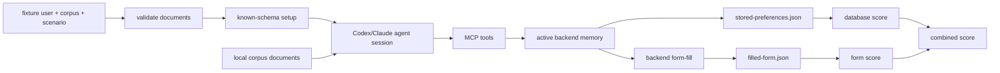
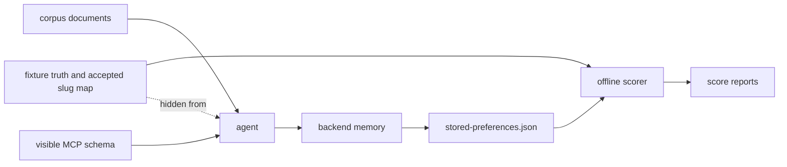
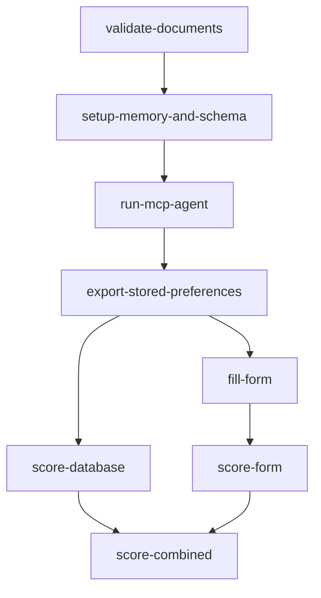

# MCP Agent Evaluation Design

- Status: active design
- Last updated: 2026-06-15
- Scope: evaluating Codex/Claude Code style agents that use MCP/tool access as
  an end-to-end eval producer
- Implementation target: first build known-schema MCP memory ingestion, with a
  runner shape that can extend to open schema and agent-filled forms later

## Summary

Build an MCP agent eval runner where the agent is the producer of backend
memory and the existing eval stack remains the judge.

The first implementation should be:

```text
known-schema fixture setup
  -> shared reset/definition setup
  -> one fixed Codex/Claude agent session
  -> agent reads local corpus documents
  -> agent writes active backend memory through MCP
  -> exporter writes stored-preferences.json
  -> database scorer evaluates memory
  -> backend form-fill runner fills the form from memory
  -> form and combined scorers evaluate the result
```

This tests the most important near-term question without mixing too many
failure modes:

> Can an MCP-capable agent read the eval corpus, choose the right existing
> memory slots, write correct active preferences, and avoid hallucinating absent
> values?

Open schema and agent-filled forms should be added after this path is stable.
The first runner should still be mode-aware so those later extensions are
additive rather than rewrites.

## Recommended First Approach

Start with **MCP known-schema memory ingestion plus backend form fill**.

In this track, the agent acts as the extractor and ingestor. The agent should
read local documents and use MCP tools to write active backend memory. The
backend product form-fill endpoint should then fill the form from that memory.



Why this should be first:

- It reuses the current deterministic exporter and scorers.
- It compares cleanly against the known-schema document ingestor.
- It keeps attribution legible: memory failures appear in the database score;
  product form-fill failures appear in the form and combined scores.
- It tests real MCP behavior: tool discovery, schema inspection, active memory
  writes, and optional self-checking through MCP reads.
- It avoids building open-schema scoring before seeing real agent behavior.

What this does not test yet:

- Whether the agent can fill PDF forms itself.
- Whether the agent can invent durable schema from scratch.
- Whether MCP can upload documents through product document analysis. The
  current MCP surface does not expose a document upload/analyze tool, so the
  first runner should provide local corpus files for the agent to read.

## Existing Eval Boundary

The current evaluation architecture intentionally separates producers from
scorers:

```text
producer prepares backend/output state
  -> exporter or snapshot builder writes artifacts
  -> scorers read artifacts and fixture truth
```

For MCP, the agent should be just another producer.

Existing artifacts to reuse:

- `validation-report.json`
- `stored-preferences.json`
- `database-score-report.json`
- `filled-form.json`
- `form-fill-score-report.json`
- `combined-score-report.json`
- `evaluation-run.json`

Existing commands to reuse after the agent stage:

- `pnpm eval:export-stored-preferences`
- `pnpm eval:fill-form`
- `pnpm eval:score --mode database`
- `pnpm eval:score --mode form`
- `pnpm eval:score --mode combined`

Do not put model judgment inside the scorer. Any LLM review of novel slugs,
transcripts, or agent behavior should be a separate diagnostic layer.

## Answer-Key Isolation

The agent must not see the expected result during the run.

The agent may see:

- the task objective
- the local corpus document paths and contents
- the MCP server/tool surface
- the target scenario or form purpose when the variant needs it
- existing visible preference schema through MCP tools

The agent must not see:

- `profile.yaml`
- `validation-report.json`
- `fact-storage-map.v1.json`
- expected `filled-form.json` snapshots
- `database-score-report.json`
- `form-fill-score-report.json`
- `combined-score-report.json`
- any accepted-slug answer key

The scorer sees the hidden truth after the agent stops:



The benchmark loop should be:

```text
fixed prompt
  -> one agent session
  -> agent completes or times out
  -> export
  -> score
```

Do not feed score results back into the same attempt.

## CLI Runner Versus Skill

The canonical benchmark should be a CLI runner. A skill can be useful for
manual prototyping, but it should not be the primary source of benchmark truth.

### CLI Runner

Proposed command:

```bash
pnpm eval:e2e-mcp-agent \
  --agent codex \
  --schema-mode known \
  --form-mode backend \
  --user alex-i9-test \
  --corpus realistic \
  --scenario alex-i9-realistic \
  --artifacts-root /private/tmp/alex-mcp-known \
  --mcp-server context-router-local \
  --reset-memory
```

The CLI should own:

- fixture validation
- backend memory reset
- schema setup strategy
- prompt construction
- agent process invocation
- timeout and completion handling
- transcript capture
- memory export
- form fill
- scoring
- `evaluation-run.json` and `mcp-agent-run.json`

The agent process should own only the task attempt:

- inspect documents
- inspect MCP schema/tools
- write active memory through MCP
- optionally verify stored memory through MCP reads
- emit a final completion signal

### Skill

A Codex/Claude skill can mirror the task instructions for manual experiments:

```text
Read this corpus root, use the configured Context Router MCP server, populate
active memory for the current user, and stop when complete.
```

Skill pros:

- fast prompt iteration
- useful for manual demos
- good way to debug agent instructions

Skill cons:

- less reproducible than a runner
- harder to enforce fixed timeout and no answer-key access
- harder to guarantee artifact capture
- session context can leak uncontrolled help or hints

Best compromise:

- Store the durable task prompt in the repo.
- Optionally package that prompt as a skill for manual use.
- Have the CLI runner use the same prompt text, with generated variables for
  corpus path, schema mode, form mode, and MCP server name.

## One-Shot Meaning

The MCP eval should be one-shot at the benchmark level, not one raw LLM
completion.

One eval run means:

```text
one fixed prompt
  + one agent session
  + allowed tools
  + fixed corpus
  + no score feedback
```

Inside that single session, the agent may take many steps:

- read multiple files
- call `listPreferenceSlugs`
- call `searchPreferences`
- call `mutatePreferences`
- verify active memory
- correct its own mistakes before final completion

That is intentional. MCP evaluation is testing agentic behavior, not just one
model completion.

## Runner Shape

Build `eval:e2e-mcp-agent` as a sibling of `eval:e2e-known-schema`, not as a
generic pipeline engine yet. Keep the internals strategy-based so open schema
can be added cleanly.

Recommended stage order for the first version:

```text
validate-documents
  -> setup-memory-and-schema
  -> run-mcp-agent
  -> export-stored-preferences
  -> score-database
  -> fill-form
  -> score-form
  -> score-combined
```



The first implementation should support:

- `--schema-mode known`
- `--form-mode backend`
- `--agent codex` or `--agent claude`
- `--mcp-server <name>`
- `--agent-command <command>` if explicit command invocation is needed
- `--agent-timeout-ms <ms>`
- `--prompt-template <path>` optional override
- `--model-label <label>` for artifact comparison
- `--reset-memory`
- `--run-id <id>`

Reserve but do not fully implement:

- `--schema-mode open`
- `--form-mode agent`

If a reserved mode is passed before implementation, fail clearly with a usage
error.

## Schema Mode Strategy

The runner should make schema mode explicit from day one.

### Known Schema

Known-schema setup should:

- reset active memory when requested
- ensure accepted eval definitions exist before the agent runs
- create definitions only as setup, not as stored values
- avoid passing the accepted slug map to the agent
- tell the agent to inspect visible schema through MCP

Implementation note:

- Extract the reset and definition-setup primitives currently private to
  `examples/eval/scripts/ingest-documents.mjs` into shared eval helpers.
- The MCP runner should use those helpers directly; it should not invoke
  `eval:ingest-documents`, because that command's main job is product document
  upload and suggestion application.

Known-schema prompt intent:

```text
Use the existing visible preference schema. Read the local documents. Store
durable active preferences through MCP for facts supported by the documents.
Leave unsupported or absent facts unset.
```

Known-schema scoring:

- use the existing database scorer and accepted slug map
- accepted slug accuracy is meaningful
- value recovery, wrong slug, wrong value, conflict, missing, and missing-value
  hallucination classifications remain useful

### Open Schema

Open-schema setup should later:

- reset active memory
- avoid pre-creating eval-specific target definitions
- optionally archive or ignore prior eval-owned definitions if run isolation
  requires it
- let the agent create user-owned definitions through MCP when no suitable
  visible slug exists

Open-schema prompt intent:

```text
Use existing schema when it fits. If no suitable slug exists, create a durable,
general-purpose definition through MCP before writing the value. Do not create
one-off slugs that only describe this single document.
```

Open-schema scoring should be added after the known-schema runner is stable:

- form correctness remains the headline metric
- value recovery and abstention are deterministic primary database metrics
- exact accepted slug correctness becomes diagnostic
- novel slug quality is review-based or diagnostic at first

Open-schema likely needs one new artifact:

- `memory-snapshot.json`

The metadata should include slug, display name, description, value type, scope,
visibility, owner/backend user, and archived state.

Keep known-schema MCP on `stored-preferences.json` v1 until the open-schema
scoring layer exists. Do not make the known-schema runner depend on the enriched
snapshot just to satisfy future open-schema needs.

## Form Mode Strategy

Make form mode explicit from the start.

### Backend Form Mode

Backend form mode is the first implementation:

```text
agent writes memory
  -> backend form-fill endpoint fills PDF from active memory
  -> existing form scorer evaluates filled-form.json
```

Pros:

- isolates the agent's job to document understanding and memory writing
- directly tests whether agent-created memory is useful to the product
- reuses the current `eval:fill-form` artifact boundary
- makes comparison against the known-schema ingestor straightforward

Cons:

- does not measure whether the agent itself can fill forms
- final form failures can still come from backend form-fill behavior

### Agent Form Mode

Agent-filled forms should be a later variant:

```text
agent reads documents and/or memory
  -> agent emits fill actions or writes a filled form artifact
  -> runner converts that output to filled-form.json
  -> existing form scorer evaluates it
```

This variant is useful, but it blends more failure modes:

- document understanding
- memory use or memory bypass
- form interpretation
- PDF field handling
- direct reasoning
- tool use

Do not implement it before MCP memory-writing eval is stable.

## MCP Surface Used By The First Runner

Current MCP tools are sufficient for known-schema and open-schema memory writes:

- `listPreferenceSlugs`: schema discovery
- `searchPreferences`: stored active/suggested preference inspection
- `smartSearchPreferences`: natural-language lookup when the agent does not
  know which slugs matter
- `mutatePreferences`: active memory writes and definition mutations
- `listPermissionGrants`: diagnose hidden results or denied targets
- `consolidateSchema`: advisory schema duplication review
- `schema://graphql`: API introspection only

For the first runner, the agent should primarily use:

- `listPreferenceSlugs`
- `mutatePreferences` with `SET_PREFERENCE`
- `searchPreferences` for verification

For open schema later, the agent may also use:

- `mutatePreferences` with `CREATE_DEFINITION`
- `consolidateSchema` for duplicate checks

Current limitation:

- There is no MCP document upload/analyze tool. The runner should provide local
  document paths and expect the agent to read them directly.

If a future eval needs the agent to drive product document analysis through
MCP, add a dedicated MCP tool for document upload/analyze and make that a
separate producer mode.

## Agent Prompt Contract

The runner should generate a prompt from a repo-local template.

The prompt should include:

- corpus root path
- a runner-generated document list with paths and safe labels
- target scenario/form purpose, if `form-mode backend` needs the agent to know
  what durable memory is relevant
- MCP server name
- schema mode
- allowed behavior
- completion requirements

The prompt should not include:

- expected values
- accepted slugs
- validation report details
- profile truth
- score report paths
- raw `manifest.json` evaluation metadata such as `factContract`,
  `intentionallyMissing`, `evaluationRole`, or corpus-truth fields

Known-schema prompt should instruct the agent to:

- inspect visible schema through MCP
- store only facts supported by current, relevant documents
- skip unsupported values instead of guessing
- prefer active `SET_PREFERENCE` writes over suggestions for this benchmark
- include structured evidence when useful, without leaking hidden truth
- verify final active memory with MCP reads
- finish with a concise completion marker

Example completion marker:

```text
EVAL_MCP_AGENT_DONE
```

The runner can use this marker as a soft completion signal, while still relying
on timeout and process exit status for hard control.

## Agent Invocation

The first implementation can invoke Codex/Claude through command-line tools.
The runner should treat the command as a black-box agent process.

Potential command strategy:

```text
agent adapter
  -> build prompt file
  -> run configured command with prompt input
  -> capture stdout/stderr/transcript
  -> return exit code, duration, and completion marker status
```

The exact invocation may differ for Codex and Claude. Keep that difference in
small adapters:

- `codex` adapter
- `claude` adapter
- optional `command` adapter for arbitrary local experiments

Each adapter should report:

- command display name with secrets redacted
- started/ended timestamps
- exit code
- timeout status
- transcript path
- completion marker observed
- stderr/stdout summary lines

Do not write auth tokens to disk. The MCP client authentication state should
come from the configured MCP client, not from prompt text.

## Artifact Contract

Add `mcp-agent-run.json` as the agent-stage artifact.

Suggested shape:

```json
{
  "schemaVersion": 1,
  "artifactType": "mcp-agent-run",
  "runId": "mcp-known-alex-i9-test-realistic-20260615T120000Z",
  "status": "pass",
  "userId": "alex-i9-test",
  "corpusId": "realistic",
  "scenarioId": "alex-i9-realistic",
  "schemaMode": "known",
  "formMode": "backend",
  "agent": {
    "provider": "codex",
    "modelLabel": "gpt-5.4",
    "mcpServer": "context-router-local",
    "timeoutMs": 900000,
    "completionMarkerObserved": true
  },
  "setup": {
    "resetMemory": true,
    "knownSchemaDefinitionsEnsured": true,
    "createdDefinitionCount": 12
  },
  "prompt": {
    "templatePath": "examples/eval/prompts/mcp-known-schema.md",
    "renderedPromptPath": "mcp-agent-prompt.md",
    "promptHash": "sha256:..."
  },
  "documents": {
    "documentsRoot": "examples/eval/users/alex-i9-test/corpora/realistic",
    "documentCount": 10
  },
  "transcript": {
    "path": "mcp-agent-transcript.txt",
    "redacted": true
  },
  "summary": {
    "durationMs": 123456,
    "exitCode": 0,
    "toolCallCount": null,
    "preferenceWriteCount": null,
    "definitionCreateCount": null
  },
  "artifacts": {
    "storedPreferences": "stored-preferences.json",
    "databaseScoreReport": "database-score-report.json",
    "filledForm": "filled-form.json",
    "formScoreReport": "form-fill-score-report.json",
    "combinedScoreReport": "combined-score-report.json"
  },
  "startedAt": "2026-06-15T12:00:00.000Z",
  "endedAt": "2026-06-15T12:05:00.000Z"
}
```

The top-level `evaluation-run.json` should include the MCP stages. Update
`evaluation-run.schema.json` from its current known-schema-only shape so it can
validate both the existing `known-schema` wrapper and the new MCP modes.

Suggested `evaluationMode` values:

- `known-schema`
- `mcp-known-schema`
- `mcp-open-schema`
- `mcp-agent-form`

Suggested MCP stage names:

- `validate-documents`
- `setup-memory-and-schema`
- `run-mcp-agent`
- `export-stored-preferences`
- `score-database`
- `fill-form`
- `score-form`
- `score-combined`

## Scoring

### Known Schema

Use the existing database, form, and combined scorers unchanged at first.

Primary metrics:

- database known-present correct count
- database value recovery rate
- database accepted-slug accuracy
- intentionally missing abstention rate
- form known-field accuracy
- form missing-field abstention rate
- combined stage attribution counts

The agent should not be told these metrics during the run.

### Open Schema

Do not block known-schema implementation on open-schema scoring. When open
schema is added, keep the primary score deterministic:

- did the expected value appear anywhere in active memory?
- did intentionally missing values remain absent?
- did the final form fill correctly?

Schema quality should start as diagnostic:

- accepted/canonical slug
- accepted alias slug
- novel slug needing review
- novel useful slug after review
- novel ambiguous or too-broad slug
- wrong slug for value

LLM or human review of novel slug quality should be a separate artifact, not
hidden inside the primary scorer.

## Failure Policy

Low scores are not runner failures.

The runner should fail only on setup/runtime/artifact failures:

- validation hard failure
- backend auth/setup failure
- MCP agent command failed or timed out
- required completion marker missing, if configured as required
- export failed
- score command failed because input artifacts were invalid or fixture readiness
  was unscorable
- form-fill runtime failure

If the agent completes and writes poor memory, the run should still reach the
score reports. That low score is the benchmark output.

## Pros And Cons Of Main Approaches

### Known-Schema MCP Memory Ingestion

Pros:

- best first implementation
- clear comparison with existing known-schema ingestor
- no new scorer required
- tests real agent use of MCP write tools
- keeps answer key hidden

Cons:

- does not measure schema invention
- does not measure direct agent form filling
- requires local agent CLI integration

### Open-Schema MCP Memory Ingestion

Pros:

- tests agent-driven definition and slug discovery
- possible with current MCP mutation surface
- closer to flexible user-owned memory behavior

Cons:

- needs schema metadata export
- exact slug scoring is not enough
- review-based schema quality will likely be needed
- harder to compare against the known-schema document ingestor

### Agent-Filled Form

Pros:

- closest to a delegated user workflow
- useful for comparing Claude versus Codex directly
- can measure whether the agent can use memory and documents together

Cons:

- harder failure attribution
- may bypass backend memory entirely
- needs a stable artifact contract for agent-produced `filled-form.json`
- adds PDF/form interpretation risk before memory ingestion is proven

### MCP Document Upload Tool

Pros:

- lets the agent drive the product upload/analyze path through MCP
- useful if "agent uploads documents" is a product goal

Cons:

- requires backend MCP surface work
- mostly evaluates product document analysis, not agent extraction
- should be separate from local-file-reading agent ingestion

## Implementation Checkpoints

### Checkpoint 0: Shared Setup Extraction

- Extract reusable fixture loading, `resetMyMemory(MEMORY_ONLY)`, and
  known-schema definition setup helpers from `ingest-documents`.
- Keep `eval:ingest-documents` behavior unchanged while the MCP runner reuses
  only the setup primitives.
- Add focused tests proving existing definition compatibility checks still run
  outside the upload ingestor.

Checkpoint can run targeted setup/helper tests plus existing ingestor tests.

### Checkpoint 1: Prompt And Artifact Design

- Add prompt template for known-schema MCP memory ingestion.
- Add `mcp-agent-run.schema.json`.
- Add tests for prompt rendering and artifact schema validation.

Checkpoint can run:

```bash
pnpm eval:test
pnpm eval:validate
```

### Checkpoint 2: Runner Skeleton

- Add `pnpm eval:e2e-mcp-agent`.
- Parse CLI args.
- Write `evaluation-run.json` with `evaluationMode: "mcp-known-schema"` and
  MCP stage names.
- Stub agent stage with an injectable test runner.
- Reuse exporter, form runner, and scorers in the same style as
  `eval:e2e-known-schema`.

Checkpoint can run targeted tests for the wrapper without a live agent.

### Checkpoint 3: Known-Schema Setup Strategy

- Reuse the extracted known-schema definition setup helpers.
- Ensure definitions before the agent stage.
- Reset memory when requested.
- Do not pass accepted slug map or profile truth into the prompt.

Checkpoint can run setup tests with mocked backend calls.

### Checkpoint 4: Agent Adapters

- Add Codex adapter.
- Add Claude adapter.
- Add optional generic command adapter if useful.
- Capture transcript and completion marker.
- Redact secrets from persisted lines.

Checkpoint can run adapter tests with fake local commands.

### Checkpoint 5: Live Known-Schema Smoke

- Configure `context-router-local` MCP.
- Run against `alex-i9-test` / `realistic` / `alex-i9-realistic`.
- Save artifacts under `/private/tmp`.
- Inspect `mcp-agent-run.json`, `stored-preferences.json`, and score reports.

Expected command:

```bash
pnpm eval:e2e-mcp-agent \
  --agent codex \
  --schema-mode known \
  --form-mode backend \
  --user alex-i9-test \
  --corpus realistic \
  --scenario alex-i9-realistic \
  --artifacts-root /private/tmp/alex-mcp-known \
  --mcp-server context-router-local \
  --reset-memory
```

### Checkpoint 6: Open-Schema Preparation

Only after the known-schema smoke is useful:

- add schema snapshot artifact
- add `--schema-mode open`
- add open-schema prompt template
- add deterministic value-recovery scoring or open-schema database diagnostics
- keep form score as the headline metric

## Open Questions

- What exact Codex CLI invocation should the adapter use for non-interactive
  runs with MCP already configured?
- What exact Claude CLI invocation should the adapter use for non-interactive
  runs with MCP already configured?
- Should the completion marker be required, or should process exit code plus
  timeout be enough?
- Should the agent see the target form name/purpose in known-schema memory
  ingestion, or only the broader instruction to store durable user memory?
- Should the first prompt tell the agent to verify active memory after writes,
  or leave verification behavior unconstrained?
- How much transcript detail can be stored without accidentally preserving
  sensitive local paths or auth-related output?
- Should tool-call counts come from MCP access logs, agent transcript parsing,
  or stay null until a robust source exists?

## Decision Record

- Use MCP known-schema memory ingestion as the first implementation.
- Use a CLI runner as the canonical benchmark surface.
- Allow skills for manual prompt experimentation, but do not make skill runs the
  canonical benchmark.
- Keep answer-key artifacts hidden from the agent.
- Reuse existing deterministic scorers.
- Use backend form fill first.
- Make schema mode and form mode explicit now so open schema and agent-filled
  forms are later extensions.
