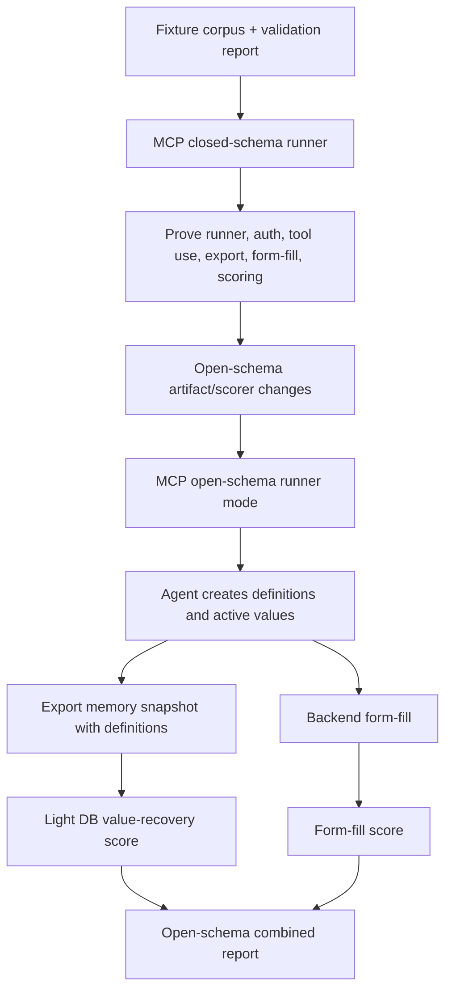
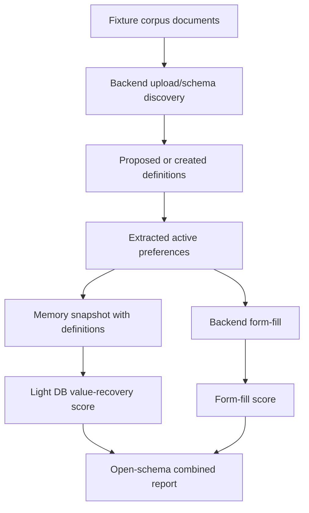

# Open-Schema Evaluation Design

- Status: implementation-ready brainstorm
- Last updated: 2026-06-15
- Scope: evaluating runs where the producer may create its own
  preference definitions/slugs instead of using pre-created eval definitions
- Prerequisite: implement the closed-schema MCP eval described in
  `docs/plans/evaluation/scoring/MCP-scoring/` first

## Summary

Open-schema evaluation should answer one main question:

> Can the system complete the user's form-filling goal when the exact memory
> schema is not supplied ahead of time?

The first open-schema metric should not be strict slug quality. The first metric
should be whether the final form is correct and safe. Schema quality still
matters, but it is harder to score deterministically and should remain
diagnostic until we have real outputs to review.

Recommended priority:

```text
form correctness > active-memory value recovery > schema quality
```

The implementation path should be:

1. Build MCP closed-schema eval first in `MCP-scoring`.
2. Add an enriched `memory-snapshot.json` export so open-schema runs can
   preserve definition metadata without changing the known-schema
   `stored-preferences.json` scorer contract.
3. Add a light open-schema DB/debug score based on value recovery and
   abstention.
4. Add MCP open-schema mode by reusing the closed-schema MCP runner shape.
5. Add backend upload-level open-schema discovery later.
6. Harden schema-quality scoring only after reviewing real novel slugs.

## Why Closed-Schema MCP Comes First

Closed-schema MCP eval should be implemented before open-schema changes because
it isolates the runner/tooling problem from the schema-discovery problem.

Closed-schema MCP proves:

- the agent runner can launch and complete repeatably
- MCP auth and tool permissions work
- the agent can read corpus documents
- the agent can write active backend memory
- the exporter, form runner, and scorers produce stable artifacts
- MCP results are comparable to the existing known-schema backend ingestor

Open schema should then be a controlled delta:

- same corpus
- same form scorer
- same backend form-fill path
- same MCP runner structure
- no pre-created eval definitions
- new definition metadata export
- light value-recovery DB score instead of strict slug headline scoring

## Definitions

Known schema:

```text
accepted definitions/slugs already exist
  -> producer extracts values into those slugs
  -> DB scorer checks expected values under accepted keys
  -> form fill uses active memory
```

Open schema:

```text
eval-specific definitions/slugs are not pre-created
  -> producer identifies useful facts
  -> producer creates definitions/slugs as needed
  -> producer stores active values
  -> backend form fill uses active memory
  -> scorer evaluates task success and memory diagnostics
```

Producer means the thing being evaluated:

- MCP/Codex/Claude agent using MCP tools.
- Future backend upload/schema-discovery product flow.
- Future manual or UI-driven flow, if it writes the same artifacts.

## Target Flow

The first open-schema implementation should reuse the closed-schema MCP runner,
but switch setup and scoring modes.



Future backend product flow:



## Primary Metric: Form Correctness

Question:

```text
Did the final filled form contain the right values and blanks?
```

This should be the headline score for open schema. It directly measures whether
the generated memory was useful for the user's task.

Use the existing form scorer as much as possible. Its current buckets are
already the right starting point:

- should-fill field correct
- should-fill field missing
- should-fill field wrong
- abstention field correctly blank/skipped
- abstention field hallucinated
- structural skip fields excluded from primary known-field accuracy
- structural overfills reported separately
- unsupported fields reported separately

For open schema, `sourceSlugAgreementRate` should be treated as diagnostic only.
Novel slugs may be correct and useful even though they are not in the accepted
slug map.

## Debug Metric: Active-Memory Value Recovery

Question:

```text
Did the expected value appear anywhere in active memory?
```

This should be the first DB/memory score for open schema. It intentionally
ignores exact slug correctness as a primary pass/fail condition.

Useful classifications for known-present facts:

- `value_found_accepted_slug`
- `value_found_novel_slug`
- `value_found_only_suggestion`
- `value_missing`
- `accepted_slug_wrong_value`
- `conflict`

Useful classifications for intentionally missing facts:

- `missing_absent_correct`
- `missing_value_hallucinated`
- `missing_key_hallucinated`
- `missing_hallucinated`

Value matching should remain deterministic:

- dates allow known render variants
- SSNs allow dashed and digits-only variants
- phone numbers allow punctuation variants
- arrays compare normalized typed values
- short strings should avoid broad substring matching
- near misses should be diagnostics, not accepted silently

The existing known-schema database scorer can inform this implementation, but
open-schema DB scoring should headline value recovery rather than accepted-slug
accuracy.

## Diagnostic Metric: Schema Usefulness

Question:

```text
Was the value stored under a definition that is useful for future reuse?
```

Do not make this the first open-schema headline score.

The scorer should preserve enough metadata for later review:

- slug
- display name
- description
- value type
- options
- scope
- namespace or ownership
- active value
- source type, confidence, and evidence if available
- whether the slug matched a canonical or accepted alias slug

Initial schema buckets can be simple diagnostics:

- `accepted_canonical_slug`
- `accepted_alias_slug`
- `novel_review_needed`
- `accepted_slug_wrong_value`
- `wrong_slug_for_value`

Later reviewed buckets can be added after real outputs exist:

- `novel_useful`
- `novel_too_broad`
- `novel_too_narrow`
- `novel_duplicate`
- `novel_ambiguous`
- `novel_form_overfit`

LLM or human review should be a separate layer, not hidden inside the primary
score.

## Artifact Contract

Open-schema scoring needs definition metadata. The current
`stored-preferences.json` stores values but not enough schema context.

Recommended artifact:

```text
memory-snapshot.json
```

Keep `stored-preferences.json` v1 for known-schema MCP and existing scorers.
Open-schema should consume `memory-snapshot.json` so known-schema runner work is
not blocked on a broader artifact migration.

Suggested shape:

```json
{
  "schemaVersion": 1,
  "artifactType": "memory-snapshot",
  "runId": "alex-i9-open-schema-20260615-120000",
  "userId": "alex-i9-test",
  "corpusId": "realistic",
  "storageInput": {
    "schemaMode": "open",
    "producer": "mcp-agent",
    "statusesScored": ["ACTIVE"],
    "suggestionsWereAutoApplied": false
  },
  "preferences": [
    {
      "id": "pref-id",
      "definitionId": "definition-id",
      "slug": "employee.legal_name",
      "value": "Alex Jordan Rivera",
      "status": "ACTIVE",
      "sourceType": "INFERRED",
      "confidence": 0.91,
      "evidence": {}
    }
  ],
  "suggestions": [],
  "definitions": [
    {
      "id": "definition-id",
      "namespace": "USER:backend-user-id",
      "ownerUserId": "backend-user-id",
      "slug": "employee.legal_name",
      "displayName": "Employee Legal Name",
      "description": "Legal name used for onboarding and employment forms.",
      "valueType": "STRING",
      "scope": "GLOBAL",
      "options": null,
      "isSensitive": false,
      "isCore": false,
      "archivedAt": null
    }
  ],
  "diagnostics": {
    "backendUserId": "backend-user-id",
    "exportedAt": "2026-06-15T19:00:00.000Z"
  }
}
```

Implementation notes:

- Export definitions through existing GraphQL `exportPreferenceSchema(scope:
  ALL)`.
- Include all visible active definitions, not only definitions referenced by
  preferences. This makes unused or duplicate created definitions visible.
- Keep active preferences as the primary scored rows.
- Keep suggestions diagnostic-only unless a later eval explicitly scores
  suggestion quality.
- The key requirement is `definitions[]` joined to value rows by
  `definitionId` and slug where possible.

## Open-Schema DB Report

Suggested report:

```text
open-schema-database-score-report.json
```

Example known-present row:

```json
{
  "factKey": "identity.legalName",
  "expectedValue": "Alex Jordan Rivera",
  "classification": "value_found_novel_slug",
  "valueFoundAnywhere": true,
  "valueFoundUnderAcceptedSlug": false,
  "canonicalSlugCorrect": false,
  "acceptedAliasCorrect": false,
  "candidateRows": [
    {
      "slug": "employee.legal_name",
      "definitionId": "definition-id",
      "displayName": "Employee Legal Name",
      "description": "Legal name used for onboarding and employment forms.",
      "value": "Alex Jordan Rivera",
      "valueMatch": true,
      "schemaAssessment": "novel_review_needed"
    }
  ],
  "acceptedSlugRows": []
}
```

Example intentionally missing row:

```json
{
  "factKey": "contact.phone",
  "expectedValue": null,
  "classification": "missing_absent_correct",
  "valueFoundAnywhere": false,
  "acceptedSlugHasValue": false,
  "candidateRows": []
}
```

Suggested summary fields:

- `knownPresentTotal`
- `valueFoundAnywhere`
- `valueFoundUnderAcceptedSlug`
- `valueFoundUnderNovelSlug`
- `valueMissing`
- `acceptedSlugWrongValue`
- `conflict`
- `valueRecoveryRate`
- `acceptedSlugRecoveryRate`
- `intentionallyMissingTotal`
- `missingAbsentCorrect`
- `missingHallucinated`
- `missingAbstentionRate`
- `novelDefinitionCount`
- `unusedNovelDefinitionCount`
- `unscoredActivePreferenceCount`

## Combined Report

The existing combined report assumes known-schema DB classifications. For open
schema, use a separate combined report or a schema-mode-aware report rather than
forcing novel slug behavior into known-schema categories.

The most useful open-schema combined attribution is:

```text
memory value found + form correct
memory value found + form missing
memory value found + form wrong
memory value missing + form correct
memory value missing + form missing
memory value missing + form hallucinated
missing absent + form absent
missing hallucinated + form hallucinated
missing hallucinated + form other
```

`memory value missing + form correct` is important because it can reveal that
the form-fill path found the value outside active memory, the scorer missed a
normalization variant, or the filled-form artifact is not actually using the
same prepared memory.

## Producer Approaches

| Approach | When | Pros | Cons |
| --- | --- | --- | --- |
| MCP closed schema | First, in `MCP-scoring` | Proves runner/tooling and reuses current scoring | Does not test schema discovery |
| MCP open schema | First open-schema producer | Possible with current MCP `CREATE_DEFINITION` and `SET_PREFERENCE`; isolates backend upload changes | Agent behavior may be variable; requires good run logging |
| Backend upload-level schema discovery | After MCP open schema | Tests product-native ingestion UX | Requires backend changes because upload currently shows valid slugs and rejects unknown slugs |
| Agent-filled form | Later | Evaluates full delegated workflow | Harder attribution; may bypass backend memory |
| Hard schema-quality review | Much later | Captures reuse quality and overfitting | Requires human or LLM judgment and real examples |

## MCP Open-Schema Runner Requirements

The MCP open-schema runner should build on the closed-schema MCP runner from
`MCP-scoring`.

Closed-schema mode should likely look like:

```bash
pnpm eval:e2e-mcp-agent \
  --agent claude \
  --schema-mode known \
  --form-mode backend \
  --user alex-i9-test \
  --corpus realistic \
  --scenario alex-i9-realistic \
  --mcp-server context-router-local \
  --mcp-config /path/to/context-router-mcp.json \
  --reset-memory \
  --artifacts-root /private/tmp/alex-mcp-known
```

Open-schema mode should likely look like:

```bash
pnpm eval:e2e-mcp-agent \
  --agent claude \
  --schema-mode open \
  --form-mode backend \
  --user alex-i9-test \
  --corpus realistic \
  --scenario alex-i9-realistic \
  --mcp-server context-router-local \
  --mcp-config /path/to/context-router-mcp.json \
  --reset-memory \
  --skip-ensure-definitions \
  --artifacts-root /private/tmp/alex-mcp-open
```

Open-schema mode should:

- reset memory values for isolation
- not pre-create eval-specific target definitions
- optionally archive or ignore previous eval-owned definitions if repeatability
  requires it
- give the agent document paths and the user goal
- allow definition creation and preference writes through MCP
- export `memory-snapshot.json`
- run light open-schema DB scoring
- run backend-memory form fill
- run form scoring
- write an agent run artifact with prompt, schema mode, tool access, stage
  statuses, and artifact paths

The first open-schema MCP eval should let the backend fill the form after the
agent writes memory. This keeps attribution clearer:

```text
agent document/schema/memory work
  -> active backend memory
  -> backend form-fill endpoint
  -> deterministic form scorer
```

## Backend Upload-Level Open Schema

Current document upload is known-schema only:

- the extraction prompt shows valid slugs
- the model is instructed to use only those slugs
- unknown slugs are filtered as `UNKNOWN_SLUG`
- definition creation is separate from upload

A backend open-schema product flow would need a new design, likely one of:

1. Upload proposes definitions and values.
   - Backend returns `proposedDefinitions[]` plus value suggestions.
   - User or runner applies both definitions and values.
   - Easier to review.
   - More product work.

2. Upload creates definitions automatically.
   - Backend writes definitions and values during ingestion.
   - Easier benchmark runner.
   - Higher risk of low-quality schema pollution.

3. Two-pass workflow.
   - First pass discovers candidate facts and definitions.
   - Second pass extracts values into the newly created schema.
   - Better attribution.
   - More latency and implementation complexity.

Do this after MCP open-schema mode. MCP can exercise the scoring layer before
the product upload path is redesigned.

## Implementation Checkpoints

### Checkpoint 0: Closed-Schema MCP Eval

Implemented under `docs/plans/evaluation/scoring/MCP-scoring/`, not this plan.

End state:

- MCP runner can populate known-schema memory.
- Existing exporter and known-schema DB scorer work.
- Backend form fill runs after MCP memory writes.
- Existing form and combined reports are produced.

### Checkpoint 1: Memory Snapshot Export

Goal:

- Add an enriched memory export artifact with `preferences[]` and
  `definitions[]`.
- Add this as a separate export path or mode rather than changing the
  known-schema `stored-preferences.json` v1 contract.

Expected tests:

- schema validation for the new artifact
- GraphQL query contract test for `exportPreferenceSchema(scope: ALL)`
- mapper tests joining preference rows to definition metadata by `definitionId`
  and slug
- token redaction tests remain intact

Progress report:

- A run can snapshot active memory and visible schema without scoring it.

### Checkpoint 2: Light Open-Schema DB Scorer

Goal:

- Score value recovery and abstention from `memory-snapshot.json`.
- Preserve strict accepted-slug results as diagnostics.

Expected tests:

- value found under accepted slug
- value found under novel slug
- value missing
- accepted slug populated with wrong value
- intentionally missing value absent
- intentionally missing value hallucinated
- novel definition metadata included in candidate rows
- fixture-readiness gating still works

Progress report:

- A static memory snapshot can produce
  `open-schema-database-score-report.json`.

### Checkpoint 3: Open-Schema Combined Report

Goal:

- Attribute form outcomes against open-schema memory outcomes.

Expected tests:

- value found and form correct
- value found and form missing
- value missing and form correct
- missing absent and form absent
- missing hallucinated and form hallucinated

Progress report:

- A memory snapshot plus filled-form snapshot can produce an open-schema
  combined report.

### Checkpoint 4: MCP Open-Schema Mode

Goal:

- Reuse the closed-schema MCP runner with `--schema-mode open`.

Expected tests:

- setup skips known-schema definition creation
- setup still resets memory values, and either archives or namespaces prior
  eval-created definitions if repeatability requires it
- stage artifact paths are recorded
- run artifact distinguishes eval fixture user and backend auth user
- partial failure writes a useful run artifact
- scoring stages consume the new open-schema artifacts

Progress report:

- One live MCP open-schema smoke can complete with form and light DB reports.

### Checkpoint 5: Backend Upload-Level Discovery

Goal:

- Design and implement product upload schema discovery after MCP open-schema
  has proven the scoring layer.

Expected tests:

- prompt/schema contract for proposed definitions
- apply flow creates definitions before setting values
- upload diagnostics preserve proposed and rejected definitions
- open-schema scorer can evaluate the resulting memory snapshot

Progress report:

- Backend upload can run without pre-created eval definitions.

### Checkpoint 6: Schema-Quality Review

Goal:

- Add human or LLM-assisted review of novel definitions after enough real runs
  exist.

Do not start here. The first useful data is form correctness plus value recovery.

## Open Questions

- Should repeated open-schema runs archive previous eval-owned definitions, use
  a fresh backend user, or record prior definitions as run context?
- Should the first open-schema MCP prompt expose the target form, or ask the
  agent to prepare generally useful memory from documents?
- Should the agent be allowed to inspect the form field map, or only the PDF and
  corpus documents?
- Should global catalog slugs remain available in open-schema mode, or should
  the eval attempt to hide most existing definitions?
- How should location-scoped definitions and values be represented in the first
  open-schema memory snapshot?
- When schema-quality review arrives, should it be human-only, LLM-assisted, or
  sampled?

## Recommended First Implementation After MCP Closed Schema

Build the smallest open-schema scoring layer that makes MCP open-schema runs
debuggable:

1. Export memory with definition metadata.
2. Score active-memory value recovery and missing-fact abstention.
3. Keep strict accepted-slug matches as diagnostics.
4. Reuse the existing form scorer as the headline score.
5. Add an open-schema combined report for attribution.
6. Run MCP in open-schema mode.

Avoid building hard schema-quality scoring before real MCP outputs exist.
