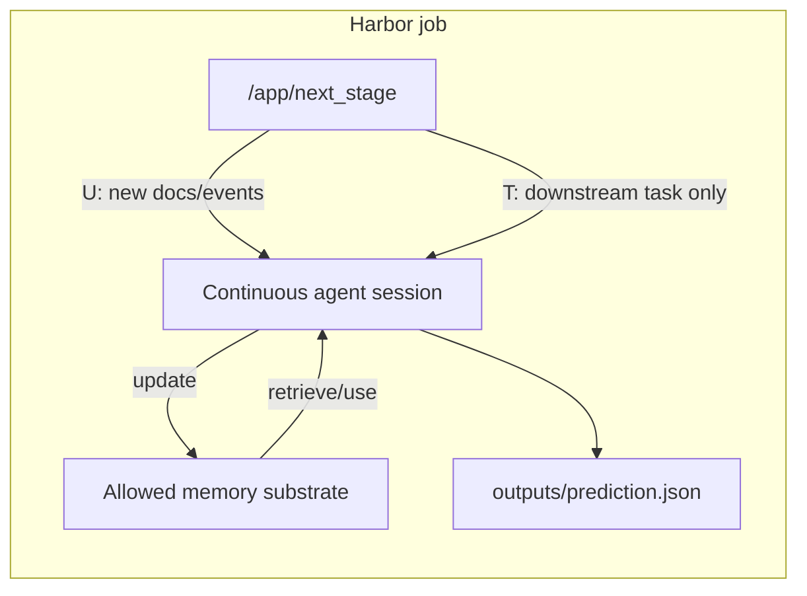

# Staged Memory Framework

This framework keeps the eval runner, task data, model, verifier, and reporting
fixed while swapping only the memory substrate.

## Research Contract

The question is:

> Given the same stream of documents or events, which memory substrate lets an
> agent retain and use the right information over time?

Current arms:

| Arm | Memory substrate |
| --- | --- |
| `context-only` | Continuous agent conversation context only |
| `markdown` | A single `/app/memory.md` file |
| `cr-mcp` | ContextRouter memory through an MCP sidecar |

The framework should not include product-specific backend form-fill or
task-specific retrieval services. Those belong to product E2E evals.

## Stage Model

The shared stage vocabulary lives in `scripts/trajectory_framework.py`.

| Token | Stage kind | Agent action |
| --- | --- | --- |
| `U` | `memory-update` | Read newly revealed docs/events and update memory |
| `T` | `downstream-task` | Answer from retained memory; no raw docs are revealed |
| `UA` | `update-answer` | Read new docs/events, update memory, and answer now |

Supported shapes include `U -> T`, `U -> T -> U -> T`,
`U -> U -> T`, `U -> U -> U -> U -> T`, and native DynamicMem
`UA -> UA -> ...` checkpoint trajectories.

## Runtime Flow



The stage server reveals one stage at a time through `/app/next_stage`.
`U` and `UA` stages expose only the new delta since the previous selected
checkpoint. `T` stages expose the downstream task but not the source docs.

The whole trajectory runs in one continuous agent session. If the arm is
`context-only`, the only retained state is the live conversation. If the arm is
`markdown` or `cr-mcp`, the agent may also use that arm's allowed external
memory.

## Data Protection Invariants

Every valid task must satisfy:

- hidden truth stays under `tests/expected`;
- staged payloads and raw source metadata are not agent-readable;
- downstream `T` stages do not expose docs or `documents.json`;
- `web_search` is disabled unless an experiment explicitly changes that;
- mode policies are enforced by both prompt instructions and validators;
- post-run validation rejects hidden path reads and disallowed durable writes.

These checks are part of the experimental contract, not optional manual review.

## Dataset Adapter Contract

Dataset adapters translate external benchmarks into the shared staged contract.
They should emit:

- a Harbor task directory;
- staged payload with ordered `U`, `T`, and/or `UA` stages;
- hidden expected data for the verifier;
- one job per arm;
- a suite manifest with source metadata, selected users/checkpoints, model,
  reasoning effort, web-search policy, timeouts, arms, and sample count.

The generic entrypoint is:

```bash
python3 examples/eval-harbor/scripts/build_dataset_suite.py \
  --dataset dynamicmem \
  --source-users user008 \
  --checkpoint-indices 0-1 \
  --stage-schedule U,U,T
```

DynamicMem is the first adapter. Future datasets should plug into the same
entrypoint instead of adding a new runner.

## Scoring Contract

The verifier scores only agent outputs, not hidden memory internals. For
DynamicMem, LLM-as-judge reward is the primary score when judge credentials are
provided; deterministic state/service diagnostics are retained for debugging.

Reports should make every experimental setting explicit:

- dataset, task id, source user, checkpoint range, and stage schedule;
- arm, model, reasoning effort, web-search policy, and timeout settings;
- sample count and concurrency;
- judge model and judge mode;
- reward/accuracy statistics, LLM State Mean, LLM Service Mean, tokens, and cost;
- validation, tool-policy, parse, and metadata failures.

For DynamicMem experiments, missing token usage, cost, LLM State Mean, or LLM
Service Mean makes the run incomplete. Treat it as a failed reporting artifact
and rerun before updating the shared logbook.

The benchmark is only useful if the task contract is sound. Treat failed
preflight or post-run validation as a failed experiment, not a noisy datapoint.
