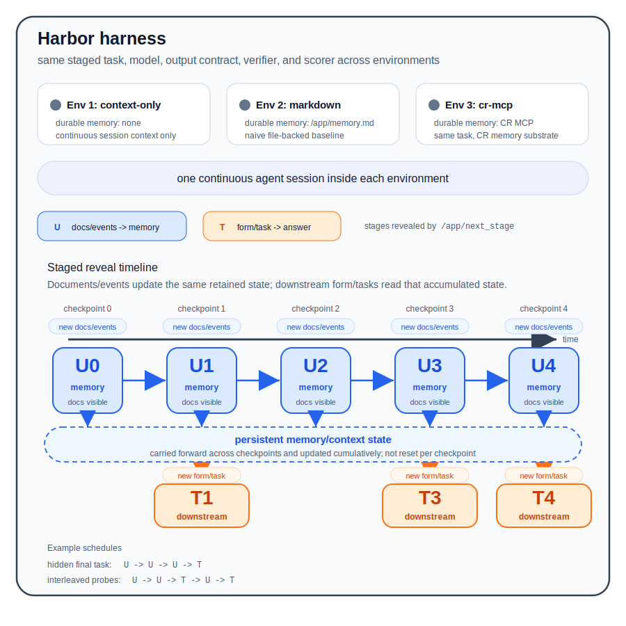
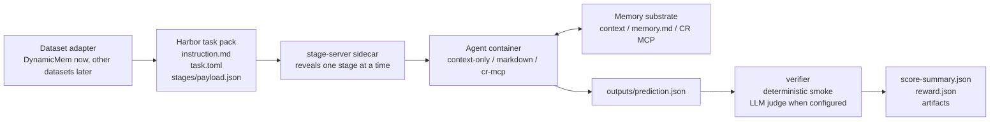

# Eval Harbor Framework

This folder documents the general evaluation framework under
`examples/eval-harbor`. The goal is to keep the runner, task contract, memory
arms, and scoring boundary explicit so new datasets can be added without
rewriting the harness.

## What This Framework Measures

The framework asks:

> Given the same agent, documents/events, sandbox, downstream task, output
> contract, and scorer, how does the memory substrate change task performance?

The memory substrate is the experimental variable. The current arms are:

| Arm | Memory substrate | Allowed durable memory |
| --- | --- | --- |
| `context-only` | Agent conversation context only | No external memory file or MCP memory |
| `markdown` | Naive external memory | `/app/memory.md` |
| `cr-mcp` | ContextRouter memory | Memory-only CR MCP sidecar |

The task data, staged reveal sequence, output path, verifier, model, and
reasoning effort should stay fixed across arms.

## Architecture





The shared stage vocabulary lives in
`examples/eval-harbor/scripts/trajectory_framework.py`. Dataset adapters should
emit this contract, then keep dataset-specific parsing and scoring in their own
builder/verifier.

## Turn Types

The framework uses three stage kinds:

| Stage kind | Shorthand | Agent-visible input | Expected output |
| --- | --- | --- | --- |
| `memory-update` | `U` | New documents/events only | Update the allowed memory substrate; do not write a prediction |
| `downstream-task` | `T` | A downstream task only | Write `outputs/prediction.json` from retained memory |
| `update-answer` | `UA` | New documents/events plus the current downstream task | Update memory and write or update a prediction for that checkpoint |

`U` and `UA` are both useful. `UA` preserves native checkpoint benchmarks where
each checkpoint asks questions immediately. `U -> ... -> T` is stricter for
background-memory evaluation because the downstream task is hidden until later.

## Current DynamicMem Adapter

The current dataset-backed adapter migrates native DynamicMem user trajectories
into Harbor staged tasks.

DynamicMem provides:

- chronological app logs for one user;
- checkpoint task packs;
- State Completion questions, which test retained personal state;
- Personalized Service tasks, which test downstream use of that state.

The adapter preserves DynamicMem semantics and only replaces the runner:

- raw app logs become staged document/event batches;
- sanitized task packs become agent-visible downstream tasks;
- hidden expected state, reference answers, scoring points, and gold evidence
  stay under `tests/expected/`;
- the agent writes the upstream-compatible `outputs/prediction.json`.

## Supported Workflows

### Native Checkpoint Trajectory

```text
UA(cp0) -> UA(cp1) -> UA(cp2)
```

Every stage reveals new logs and the current checkpoint's DynamicMem task. Every
checkpoint is scored. Use this when matching the original DynamicMem checkpoint
style.

Generated task example:

```text
examples/eval-harbor/tasks/dynamicmem-user001-cp00-02-trajectory-v1
```

### Hidden-Final Background Memory

```text
U(cp0 logs) -> U(cp1 delta logs) -> U(cp2 delta logs) -> T(cp2 task)
```

The first stages reveal only logs. The final stage reveals the downstream task
with no raw docs. Only the final checkpoint is scored. Use this to test whether
the memory substrate preserved useful information before knowing the final task.

Generated task example:

```text
examples/eval-harbor/tasks/dynamicmem-user001-cp00-02-memory-final-v1
```

## Running The Smoke Task

Use the tiny staged smoke to verify live Harbor/Codex plumbing without running
the larger DynamicMem corpus:

```bash
CODEX_FORCE_AUTH_JSON=1 harbor run \
  -c examples/eval-harbor/jobs/smoke-staged-memory-v1-context-only.yaml \
  --jobs-dir /tmp/cr-harbor-live-smoke-staged \
  --agent-env CODEX_FORCE_AUTH_JSON=true \
  --yes \
  --n-concurrent 1
```

Expected behavior:

- Harbor starts the `stage-server` sidecar.
- The live Codex agent runs `U -> U -> U -> T`.
- The verifier reports `reward = 1.0`, `correctFields = 3`, `exceptions = 0`.

The Harbor CLI is not part of this repo. If it is not on `PATH`, install Harbor
with Python 3.12+ or call the explicit venv binary.

Run the three comparable DynamicMem arms only when you want an actual benchmark
smoke, not just runner validation:

```bash
for mode in context-only markdown cr-mcp; do
  harbor run \
    -c examples/eval-harbor/jobs/dynamicmem-user001-cp00-02-memory-final-v1-${mode}.yaml \
    --jobs-dir /tmp/cr-harbor-dynamicmem-user001-cp00-02-memory-final-v1-${mode} \
    --agent-env CODEX_FORCE_AUTH_JSON=true \
    --yes
done
```

A container-level smoke can be used when the Harbor CLI is not installed. It
should verify that:

- `/app/next_stage` reveals `U -> U -> U -> T -> done`;
- `memory-update` stages do not expose `dynamicmem-task.json`;
- the final `downstream-task` stage exposes no raw docs;
- the verifier can score an oracle prediction with reward `1.0`.

## Creating New DynamicMem Tasks

Generate one task from a local DynamicMem user directory:

```bash
python3 examples/eval-harbor/scripts/build_dynamicmem_task.py \
  --source-dir /path/to/DynamicMem/001_user_001 \
  --checkpoint-indices 0-2 \
  --stage-pattern update-only-then-final \
  --model gpt-5.4-mini \
  --reasoning-effort high
```

Generate a suite:

```bash
python3 examples/eval-harbor/scripts/build_dynamicmem_suite.py \
  --source-root /path/to/DynamicMem \
  --checkpoint-indices 0-2 \
  --stage-pattern update-only-then-final \
  --max-users 5 \
  --max-tasks 5 \
  --arms-config examples/eval-harbor/arms/dynamicmem-default.json \
  --model gpt-5.4-mini \
  --reasoning-effort high \
  --manifest examples/eval-harbor/suites/dynamicmem-memory-final-smoke.json
```

Use `--stage-pattern update-answer-every-checkpoint` for `UA -> UA -> ...`
tasks.

## Adding A New Dataset

To add a new dataset, create a dataset adapter instead of changing the runner.
The adapter should:

1. Load the source dataset and select a user/session/task slice.
2. Emit ordered stages using the shared stage kinds.
3. Keep hidden truth under `tests/expected/`.
4. Write a verifier that reads `outputs/prediction.json`.
5. Reuse the same arm config pattern for `context-only`, `markdown`, and
   `cr-mcp`.
6. Add a soundness report that explains what is visible, what is hidden, what is
   scored, and why the task is valid.

After generation, run:

```bash
python3 -m py_compile \
  examples/eval-harbor/scripts/trajectory_framework.py \
  examples/eval-harbor/scripts/build_dynamicmem_task.py \
  examples/eval-harbor/scripts/build_dynamicmem_suite.py \
  examples/eval-harbor/scripts/validate_task_soundness.py

python3 examples/eval-harbor/scripts/validate_task_soundness.py \
  examples/eval-harbor/tasks/<task-id>

git diff --check
```

The benchmark is only useful if the task contract is sound. Do not merge tasks
that leak hidden answers, expose downstream tasks during `U` stages, hide
required evidence, or score fields that cannot be supported by the visible data.
